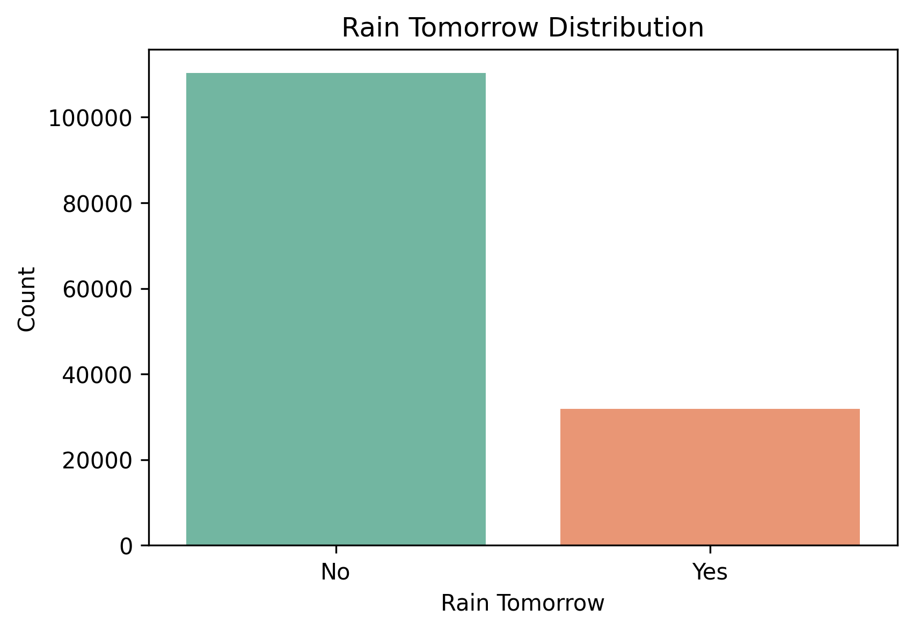

# Rain Prediction Using Logistic Regression

## Objective
The objective of this assignment is to predict whether it will rain tomorrow using a Logistic Regression model.

## Dataset
- Weather Australia Dataset
- Source: Kaggle

## Machine Learning Algorithm
- Logistic Regression

## Libraries Used
- pandas
- numpy
- matplotlib
- seaborn
- scikit-learn

## Steps Performed
1. Loaded the dataset
2. Performed data preprocessing
3. Selected relevant features
4. Split the dataset into training and testing sets
5. Trained a Logistic Regression model
6. Evaluated the model using Accuracy, Precision, Recall, and F1-score
7. Generated a Confusion Matrix and ROC Curve

## Results
- Accuracy: 84.19%
- Precision: 72.21%
- Recall: 47.92%
- F1 Score: 57.61%

## Visualizations

### Rain Tomorrow Distribution

### Confusion Matrix

### ROC Curve

## Conclusion
The Logistic Regression model successfully predicted whether it would rain tomorrow. The model achieved an accuracy of about 84%, demonstrating that Logistic Regression is suitable for this binary classification task.
